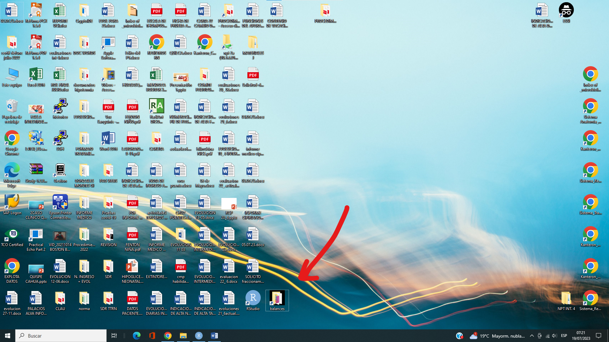

# Balance neonatología intermedios

Este es el directorio del programa para calcular balances para neonatología.

## Preparativos

El primer paso es descargar los programas necesarios. Estos son:

* [R](https://www.r-project.org/): lenguaje de programación en el cual está escrito el programa.
* [RStudio](https://posit.co/download/rstudio-desktop/): plataforma para poder usar R de forma más intuitiva/interactiva.
* [Git](https://git-scm.com/) (opcional): programa para poder descargar, actualizar, y realizar cambios en el programa.

Una vez tengamos descargado R debemos instalar algunos paquetes de la siguiente manera:

``` r
install.packages(c("purrr", "glue", "readxl"))
```

Con esto, estaríamos listos.

## Si estamos en la computadora del la UCIN 4 (HNERM) ...

Ya está todo instalado. Estoy dejando un acceso directo en el escritorio a la carpeta de este programa:



La carpeta está en "Documentos".

## Tutorial

<https://github.com/danimedi/balance_neonatologia_intermedios/assets/71237804/fbcdc046-eb2b-483f-8eb3-1b5af03f2490>

## ¿Alguna consulta o problema?

Si tienen alguna consulta, pueden escribirme a mi correo: [danielmedinaneira555\@gmail.com](mailto:danielmedinaneira555@gmail.com). Mi nombre es Daniel Medina, soy interno de medicina (y creador de este programa).
